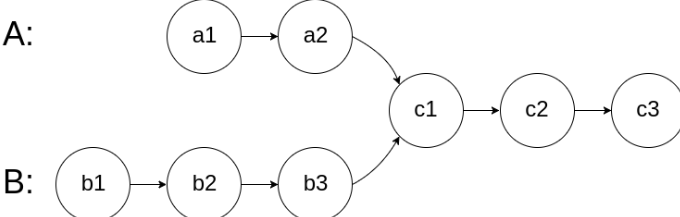

# Intersection of Two Linked Lists



## Intuition

When we place two pointers `a` and `b` at the heads of `headA` and `headB` respectively and move them forward, one pointer may reach the end (`NULL`) before the other because the lists may have different lengths before any intersection.

The intuition is simple:

* Move both pointers simultaneously until one reaches the end of its list.
* Measure how many extra nodes the longer list still has.
* Advance the head of the longer list by that extra distance.

After this alignment both lists will have the **same number of nodes remaining**. If an intersection exists, moving both pointers step-by-step from the aligned positions will make them meet at the intersection node. If they never meet, the lists don’t intersect.

---

## Approach

### Step 1 — Initialize pointers

Place two pointers `a` and `b` on the heads of the two linked lists:

```cpp
ListNode* a = headA;
ListNode* b = headB;
```

---

### Step 2 — Check for early intersection while traversing

Move both pointers in lockstep and check if they meet during the traversal:

```cpp
while (a->next != NULL && b->next != NULL) {
    if (a == b) {
        return a; // intersection found
    }
    a = a->next;
    b = b->next;
}
```

If at any point `a == b`, that node is the intersection.

---

### Step 3 — Early no-intersection check

If both pointers reach the ends of their lists without meeting, the lists do not intersect:

```cpp
if (a->next == 0 && b->next == 0 && a != b) {
    return NULL; // no intersection
}
```

---

### Step 4 — Align the lists by length

If one list finished earlier, compute how many nodes remain in the other list and advance the head of that longer list by that many nodes so both lists have equal remaining length.

Example: if list A ended first, compute remaining length of B and shift `headB` forward by that length:

```cpp
int blen = 0;
while (b->next != NULL) {
    blen++;
    b = b->next;
}
while (blen--) {
    headB = headB->next;
}
```

Do the symmetric operation when list B ends first.

---

### Step 5 — Traverse together to find intersection

Now both lists have the same number of nodes remaining. Move both heads together until they meet:

```cpp
while (headA != headB) {
    headA = headA->next;
    headB = headB->next;
}
return headB; // or return headA
```

The first node where `headA == headB` is the intersection, or both will become `NULL` if there is none.

---

## Workflow Summary

1. Start two pointers at the heads of the lists.
2. Traverse simultaneously to check for an early intersection.
3. If none found, measure the length difference of the two lists.
4. Shift the head of the longer list by that difference.
5. Traverse both lists together until the pointers meet (intersection) or reach `NULL` (no intersection).

---

## Time Complexity

`O(m + n)` — At most we traverse both lists a constant number of times (measuring lengths and aligned traversal).

## Space Complexity

`O(1)` — Only a constant number of pointers are used.

---

## Notes & Improvements

* The current implementation checks `->next` for traversal and uses explicit length-difference shifting. Another common and concise approach is to switch pointers to the opposite list head when they reach the end; the pointers will either meet at the intersection or both become `NULL` after at most `m + n` steps.
* Ensure to handle edge cases where any head is `NULL` at the beginning.

---

## Example

Consider the lists:

`A: 1 -> 2 -> 3 -> 7 -> 8`

`B: 4 -> 5 -> 7 -> 8`

The aligned traversal will arrive at node `7` as the intersection.

---

If you want, I can also:

* Add an ASCII diagram showing the alignment steps.
* Provide the alternate two-pointer switching implementation and compare both approaches.
* Create a downloadable `README.md` file or add badges and formatting for GitHub.
