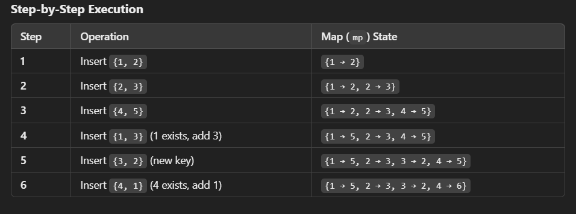
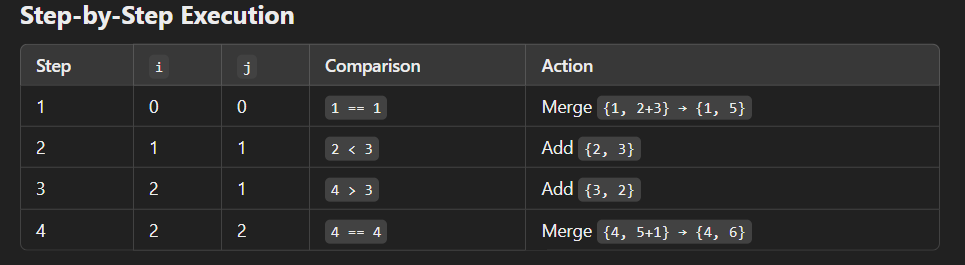

## Explanation(Approch 1)-
```
nums1 = {{1, 2}, {2, 3}, {4, 5}};
nums2 = {{1, 3}, {3, 2}, {4, 1}};

```

- So for the given input the proper walkhthrough of the solution is-



## Explanation(Approch 2)-
```
nums1 = {{1, 2}, {2, 3}, {4, 5}};
nums2 = {{1, 3}, {3, 2}, {4, 1}};
```

- Step by Step Explanation using two pointers approch-
  



- Final Output from approch 2-
```
{{1, 5}, {2, 3}, {3, 2}, {4, 6}}

```
