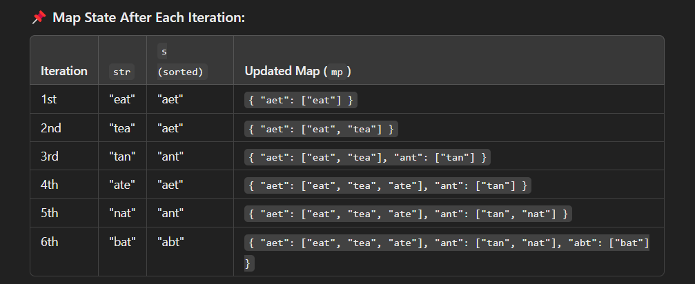
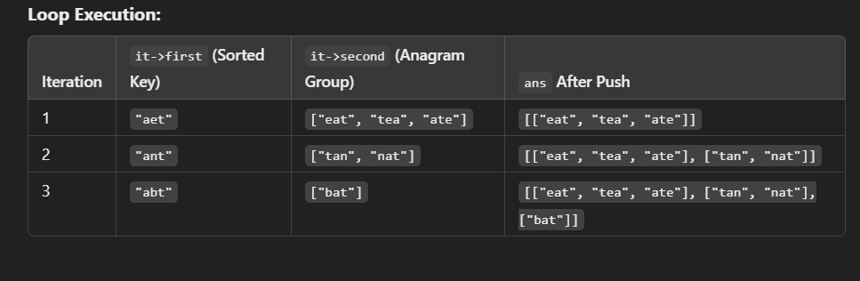

# Group Anagrams - Solution Explanation

## Problem Statement
Given an array of strings, group the anagrams together.

### **Approach**
1. Iterate through each string in the list.
2. Sort the string and use it as a key in a map.
3. Store the original strings in a list corresponding to that sorted key.
4. Return the grouped lists.

### **Code Implementation**
```cpp
#include <iostream>
#include <vector>
#include <map>
#include <algorithm>

using namespace std;

class Solution {
public:
    vector<vector<string>> groupAnagrams(vector<string>& strs) {
        map<string, vector<string>> mp; 
        for(auto str : strs) {
            string s = str;
            sort(s.begin(), s.end());
            mp[s].push_back(str);
        }

        vector<vector<string>> ans;
        for(auto it = mp.begin(); it != mp.end(); it++) {
            ans.push_back(it->second);
        }
        return ans;
    }
};

```




## Notes
- ```mp[s].push_back(str)``` Here s is a sorted string and we are creating a map where **s(The sorted string)** will be the ```key``` and we will push each time the **str(The Unsorted String)** as values in corresponding vector of strings.

- Then we have created ans vector of vector of string to store answer
- **Understand the loop for(auto it = mp.begin(); it != mp.end(); it++)**
 


- Using the loop we are iterating the entire key value map and we are pushing only ```values``` using ```it->second``` in ans.

## Time Complexity Analysis-
### Overall complexity-
- Sorting a string of length m takes ```O(m log m)```
If there are n strings, the total sorting cost is ```O(n * m log m)```.

- Space Complexity- `O(n*m)`
